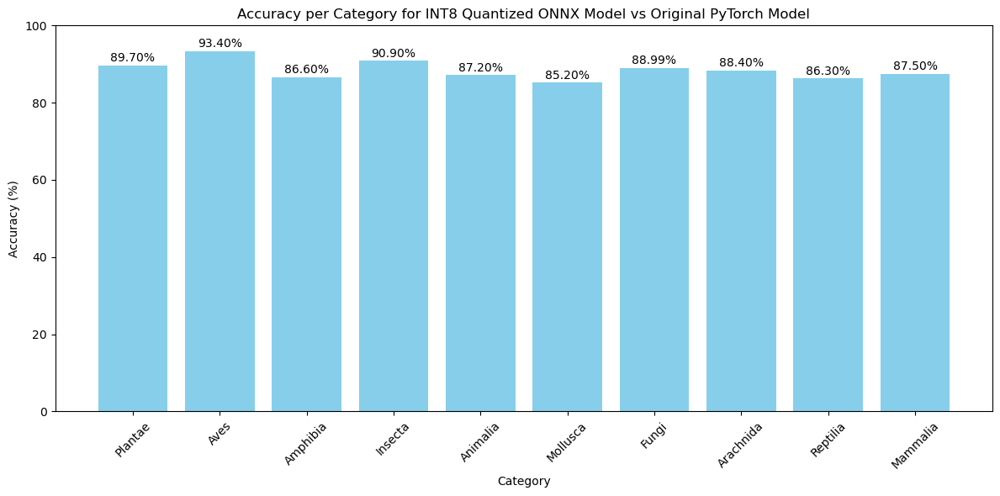

# BioClip2 Quantized Model

[[`Model on Hugging Face`](https://huggingface.co/mahan-ym/bioclip-2-quantized)]

A mobile-compatible, quantized version of [BioCLIP 2](https://huggingface.co/imageomics/bioclip-2) for efficient species classification on resource-constrained devices.

## Overview

This repository contains INT8 quantized versions of the BioCLIP 2 model, achieving **88.42% accuracy** regarding the main model while significantly reducing model size and inference time. BioCLIP 2 is a foundation model for biological organism image classification, trained on the [TreeOfLife-200M](https://huggingface.co/datasets/imageomics/treeoflife-200m) dataset.

## Model Performance

Based on testing with 10,008 images across 10 taxonomic categories:

- **Overall Accuracy**: 88.42% (8,849/10,008 correct predictions)



Full accuracy report available in [accuracy_report.txt](accuracy_report.txt).

## Files

- `bioclip2_model_int8.onnx` - INT8 quantized ONNX model
- `bioclip2_model.onnx` - Original ONNX model
- [demo/src/app.py](demo/src/app.py) - Gradio demo application
- [accuracy_report.txt](accuracy_report.txt) - Detailed accuracy metrics
- [BioClip2_Download_Test.ipynb](BioClip2_Download_Test.ipynb) - Model testing notebook

## Demo

The [demo](demo/) directory contains a Gradio application for testing the quantized model:

```python
# Launch the demo
cd demo/src
python app.py
```

The demo provides a user-friendly interface to upload images and receive species-level classifications.

## Model Details

- **Base Model**: BioCLIP 2 (ViT-L/14)
- **Training Data**: TreeOfLife-200M dataset
- **Quantization**: INT8 dynamic quantization
- **Input Size**: 224x224 pixels
- **Output**: Species-level predictions from 450K+ taxa

## Acknowledgments

This quantized model is based on [BioCLIP 2](https://huggingface.co/imageomics/bioclip-2) by the Imageomics Institute. The original model is trained on the TreeOfLife-200M dataset and provides state-of-the-art performance in biological species recognition.

## License

This project is licensed under the MIT License 2.0 - see the [LICENSE](LICENSE) file for details.